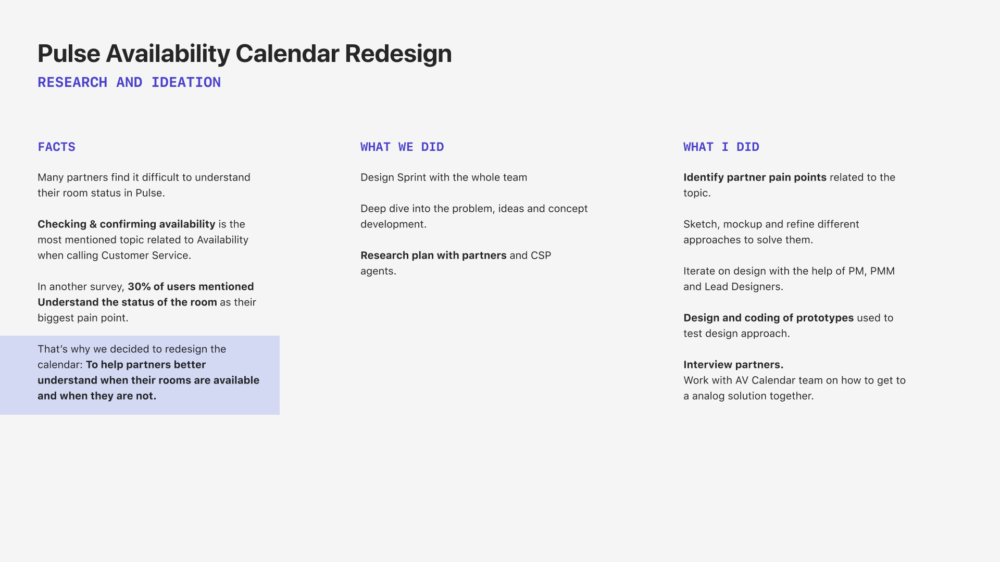
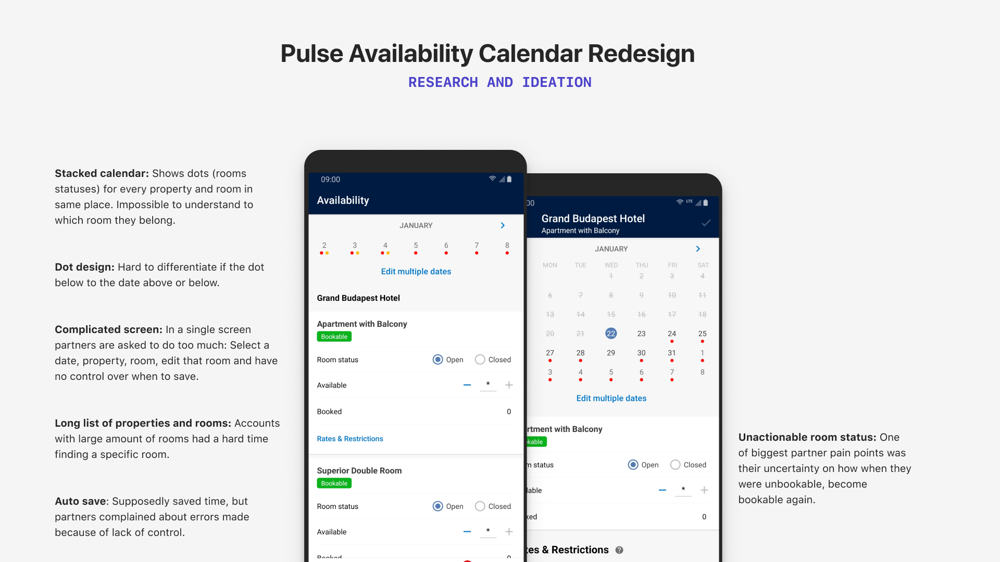
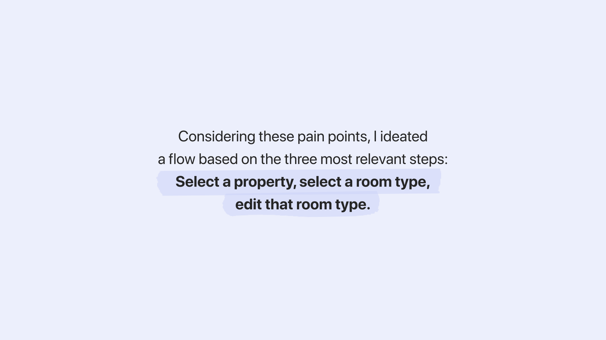
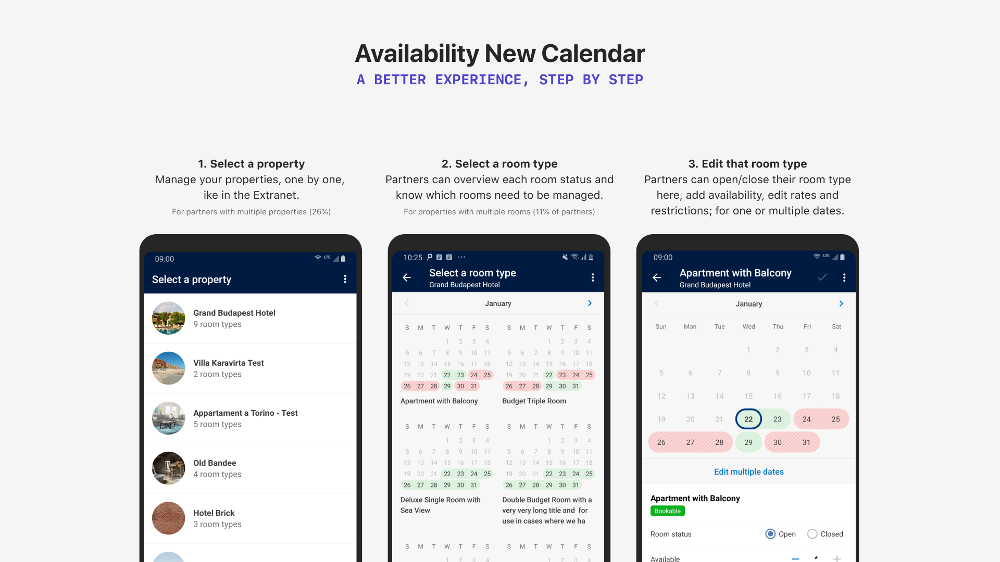
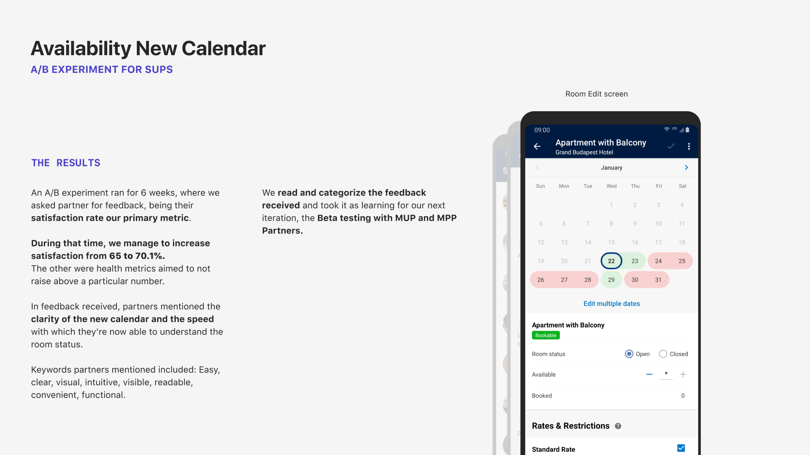
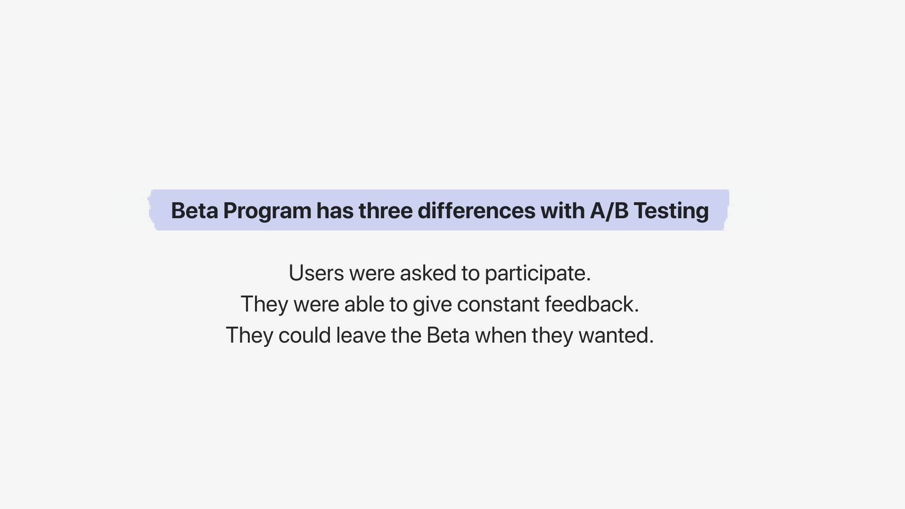
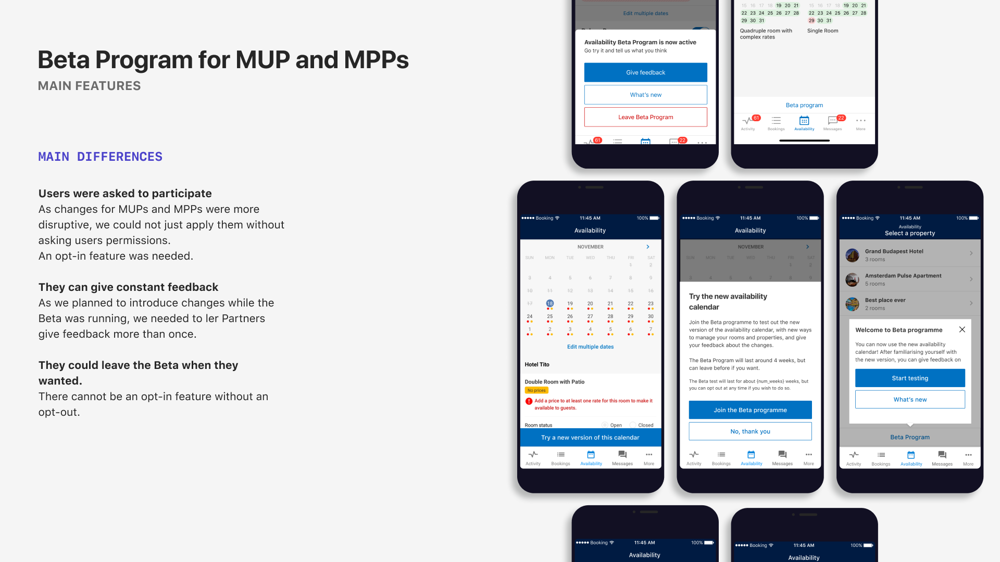

### Context
Many partners find it difficult to understand their room status in Pulse: **Checking & confirming availability** is the most mentioned topic related to Availability when calling Customer Service.

In another survey we ran 30% of users mentioned **Understanding the status of the room** as their biggest pain point.That’s why we decided to redesign the calendar: **To help partners better understand when their rooms are available and when they are not.**

