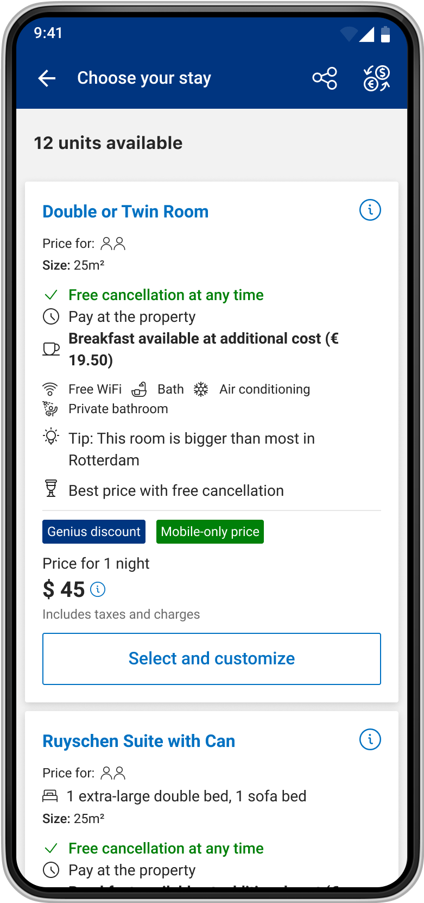
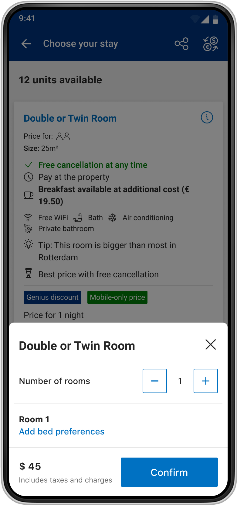
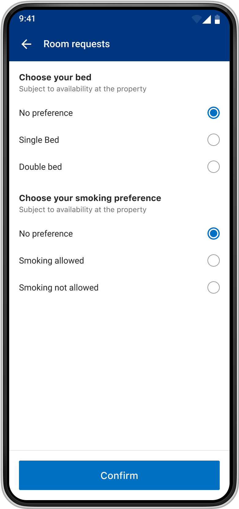
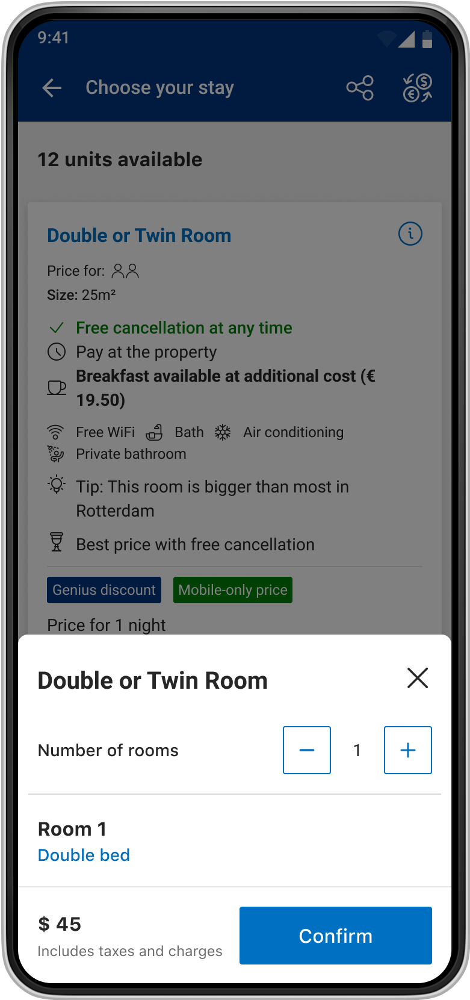
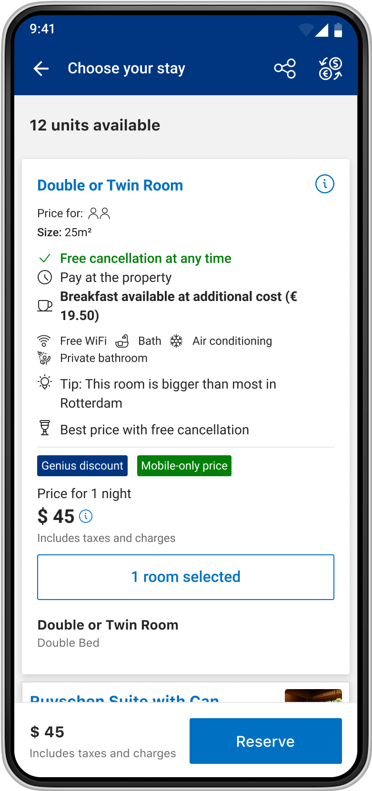
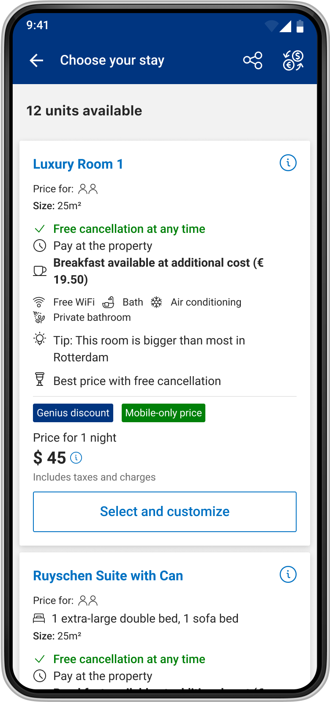
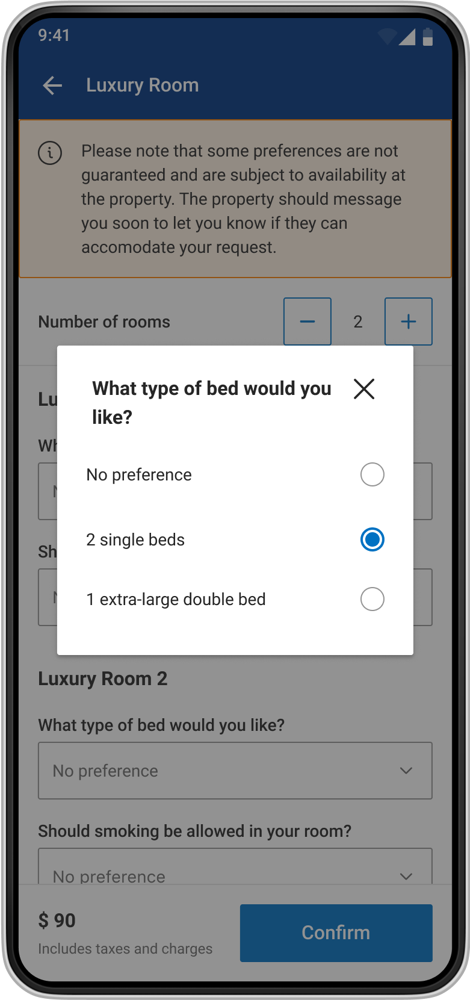
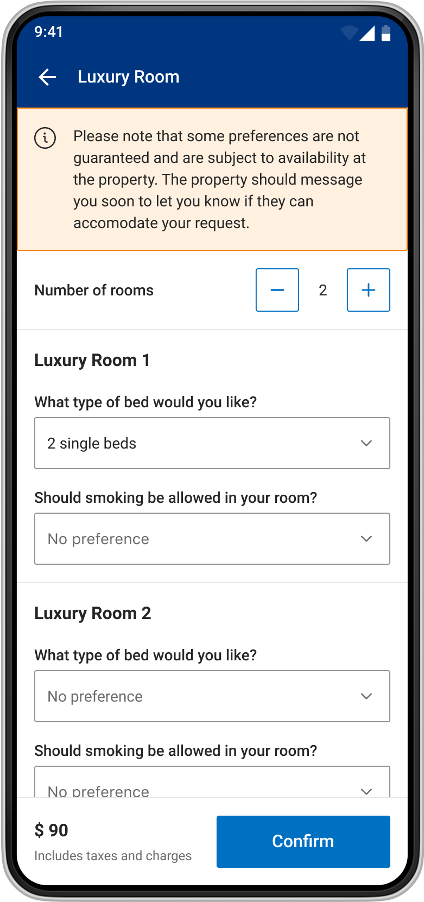
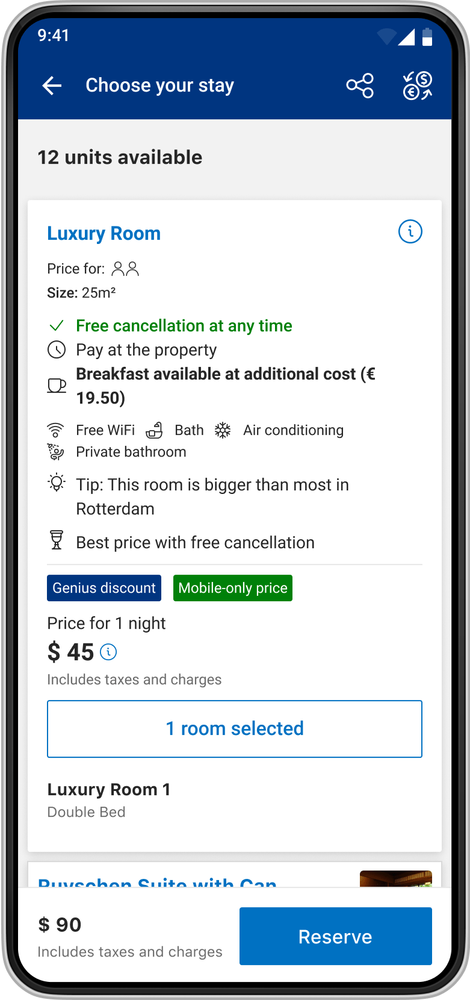

# How to let mobile users easily customize their rooms

### Current situation
Booking.com is a platform where property owners offer their own accomodations, i.e: Rooms in a hotel. A room may include different bed layouts, have breakfast included in the price or not, allow smoking or not or have other features included as part of a bundle.

Until now, Booking.com's approach to represent these rooms varitions has been to generate different room type and room cards for each of those cases. This solution, although practical in theory, actually multiplies exponentially the number of rooms offered, with minimal differences between each other.

In consequence, guests have to face a long room list difficult to navigate, with rooms which price and features are hard to differentiate.

> We currently need 8 room cards to show the same Junior Suite with minimal differences in what's offered.

<!-- These inefficient room list are formed by room cards. The room card is where we show the most relevant information regarding a room: Name, facilities, prices and discounts.
-->
### What we knew

We needed a better way to present the rooms available to our users. That meant, stop the duplication of room cards and start presenting each of these alternatives as a selection to be made by our guests. For example, we currently show different bed options as a radio group selection inside the room card.

We knew that we could not keep adding selectors inside the room card: Data showed that increasing its size made it harder for users to read room info and ended up decreasing conversion. **A separate place to add those preferences was needed.**

### What were we expecting to achieve?

By creating a better and easier way to select rooms, we expected to increase conversions and decrease cancellations.

Users would also benefit from a shorter and easier to navigate room list, where room differences and prices were easier to understand.

### In summary

	<ol>
		<li>We wanted to make it easier for users to select and customize their rooms, that meant adding more room preferences.</li>
		<li>We couldn't do it in the room card as it was complex enough. We needed a different place.</li>
		<li>We expected that by doing that, we would make room selection easier for user, thus increasing conversion and decreasing cancellation.</li>
	</ol>

	

### First two designs considered
After some exploration, I reduced the options to two prototypes. We called them Bottom sheet and Full-screen.

### Option 1: Bottom sheet design

	<iframe style="border: 1px solid rgba(0, 0, 0, 0.1);" class="responsive-iframe" src="https://www.figma.com/embed?embed_host=share&url=https%3A%2F%2Fwww.figma.com%2Ffile%2F7Pc5BjmcqlsBe9zgrgUoz9%2FIgnacio-Azzi---Portfolio%3Fnode-id%3D686%253A32347" allowfullscreen></iframe>

<!-- 	

		

			
			

			1. Customizable rooms would differentiate from other by its CTA, which read: 'Select and customize'. When tapped, it opened a bottom sheet. 

		

		

			
			

				2. There, number of rooms were selected using a stepper. Each room added had its own entry point to customize their preferences. 
			

		

		

			
			

				3. There, we used radio groups to show the different preferences. When finished, users would tap in Confirm and return to the bottom sheet.
			

		

	

	

		

			
			

				4. After confirming their preferences, users returned to the bottom sheet where they could customize their next room or tap 'Confirm' to continue.
			

		

		

			
			

				5. Back in the Room list, users would see another overview of their preferences in the room card. In hindsight, two overviews were probably an overkill. After users select all their rooms, they had to tap in 'Reserve' to continue.
			

		

	
 

-->

### Option 2: Full-screen design

In Option 2, I decided that guests would customize all the rooms in a single full-screen. Data shows that 90% of reservations are for a single room, 5% are for multiple rooms of the same type and other 5% for rooms of different types, so the possibility of having many rooms to customize was limited.

Nevertheless, we face another problem: The chance of having many preferences to be selected.I feared users would miss new preferences added below the fold, especially since we had a fixed-to-the-bottom bar with the primary CTA in it. Based on that concern, I took two decisions for this design:

1. As everything was happening in a single screen, we needed as much screen size as possible, thus a full-screen design. Our bottom-sheet could only take 80% of screen-height.
2. Preferences would be chosen using a dropdown component, which take less than radio-button groups.

In hindsight, I believe my scalability fears were exaggerated, or haven’t being proved right yet: In none of the user research we ran, we found that users don't scroll.

	<iframe style="border: 1px solid rgba(0, 0, 0, 0.1);" class="responsive-iframe" src="https://www.figma.com/embed?embed_host=share&url=https%3A%2F%2Fwww.figma.com%2Ffile%2F7Pc5BjmcqlsBe9zgrgUoz9%2FIgnacio-Azzi---Portfolio%3Fnode-id%3D686%253A31399" allowfullscreen></iframe>

<!-- 

	<iframe style="border: 1px solid rgba(0, 0, 0, 0.1);" class="responsive-iframe"  src="https://www.figma.com/embed?embed_host=share&url=https%3A%2F%2Fwww.figma.com%2Fproto%2F7Pc5BjmcqlsBe9zgrgUoz9%2FIgnacio-Azzi---Portfolio%3Fpage-id%3D686%253A30469%26node-id%3D686%253A31399%26viewport%3D517%252C497%252C0.23%26scaling%3Dcontain%26hotspot-hints%3D0" allowfullscreen></iframe>
	

		

			
			

			1. This step is the same as the one in Option 1.

		

		

			
			

				2. Here, users would see all the rooms preference in the same screen. Boolean preferences would be selected using a checkbox.
			

		

		

			
			

				3. After tapping in a dropdown, a modal would open (bottom sheet in iOS) and users would select their preferences. 
			

		

	

	

		

			
			

				4. The same selector worked as an overview, so no extra designed was needed.
			

		

		

			
			

				5. As in previous design, users return to room list and they had to tap in 'Reserve' to continue.  
			

		

	

 -->

### Feedback and Research
Then, both designs were shared with the team and Designers community: Most of the feedback concerned was regarding how users would react to an extra screen, and whether that extra step would hurt conversion. We only had one preference, so adding another screen felt like an overkill, but we had to start somewhere. 

Before A/B testing, we decided to run user testings on both designs to get users' reactions. 8 users were interviewed and asked to customize and make first a single room reservation and then a multiple room one. **Fortunately, all users were able perform the tasks assigned and no major design or copy pain points were found.**

We did have concerns about the ‘Select and customize’ copy as we would rather not use two actions in one copy tag. When asked, users could not think of a better solution.
Finally, most out of the users (6/8) preferred the bottom sheet design as it felt more ‘mobile-friendly’ and modern, compared to the full-screen design with dropdowns. While we shared those feelings, we knew that we had to test both designs to know which performed better. 

### First experiment results
After implementation, defining success metrics to track and bashing bugs, the Room Customizer A/B was A/B. To our surprise, the full screen design performed sligher better than the bottom sheet one.  

**Regarding the primary metric, conversion:**  
We detected no change outside of the acceptable cost bandwidth. So within the boundaries of the experiment we conclude this experiment is not hurting the number of bookings. An interesting learning as we are adding an additional step to the guest journey.

**Regarding the secondary behavioural metrics:**
1. 15% more guests clicked on the "select and customize" CTA on the room card.
2. For multiple room bookings there was a small increase in booking: I considered this a win as we were changing the component to use one provided by our Design System.
3. In both variants users were customizing their room less, but the effect was smaller in the full-screen variant. I understood that 

### Design analysis: What could we improve?
After experiments are done, it’s crucial to hypothesize which aspects of the design may be hurting the UX and causing the metrics behavior. These are a few of the pain points I found:

1. In both versions, the copy below the ‘Select and customize’ CTA may be overlooked.
1. In both versions, it takes users more steps and taps to customize their rooms.
1. “Based on availability” message is more prominent than before and may be one of the reasons for the decrease in booking.
1. Users are missing bed dimensions.
1. After choosing preferences, single-room bookers (95% of users) have to return to the room list to Reserve, instead of being able to do it from the Room Preferences.
Change may have been too disruptive.

After the analysis was completed, I organized a session to discuss it with the team. Together we estimate the impact and effort of each pain point. Data also helped us decided which pain-point to attack first:
We had 15% more users tapping in the ‘Select and customize’ CTA.

### Second experiment
For the second iteration, I tried to make preferences selection as simple as possible. From V1, I took the idea of having all customization options in a single screen. From V2, to use the radio button as the preferences component instead of dropdowns. While dropdowns take less space, radio button groups let users see all the options available without any user interaction.

### How to let users reserve directly from the Room Customizer?
Of all the metrics results, there was one that worried me the most: We were keeping a similar amount of users selecting preferences, but the number of reservations made with preferences was dropping significantly. 

My hypothesis was that after customizing their preferences, users were not expecting to be returned to the room list but continue to the checkout. 95% of them only selected one type of room, so there was no use . 
Originally, we planned to let users continue to checkout directly from the RC, but I couldn’t find a design in time.
The reason why, was that I was trying to keep design consistency and reuse the action bar component that was used in the rest of the flow, the action bar. The problem with that component was that it did not have a variant to show all the information we needed.

Combining that design with copy brought multiple problems: Firstly, having two buttons side by side limited copy length. Secondly, Booking.com is translated to 30+ languages with widely different lengths, i.e: Rooms (5 letters) is translated as Habitaciones (13) in Spanish. Finally, the actions described were quite complex which may need multiple words to describe it, i.e: We tested with users replacing ‘Select’ with ‘Add more rooms’ or ‘Add other rooms’. 

